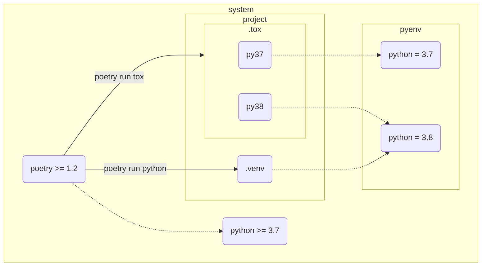
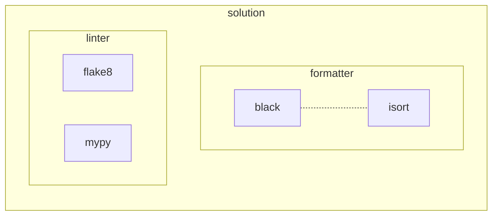
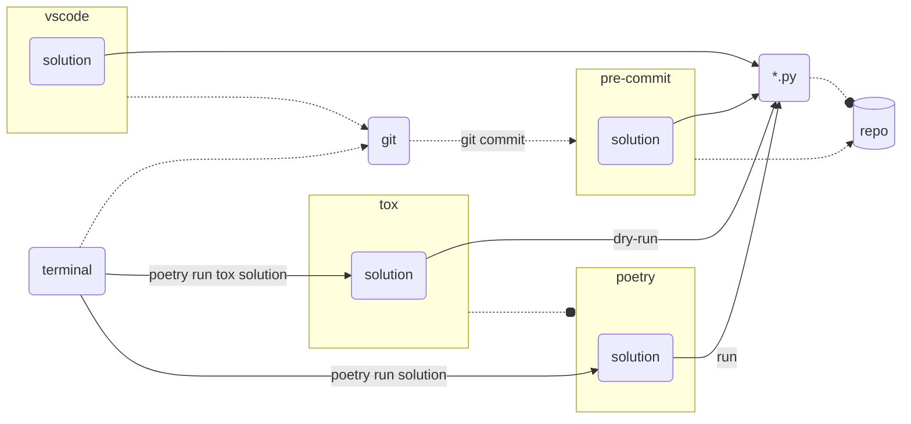
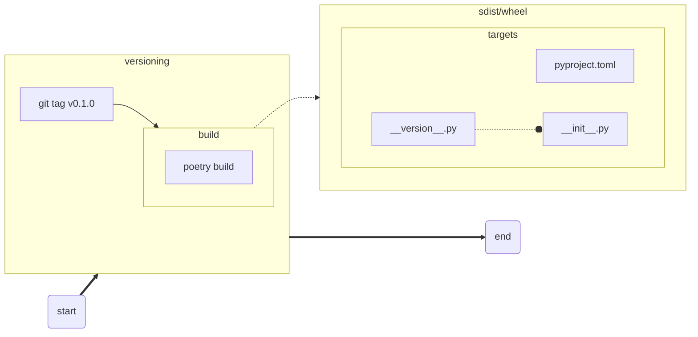
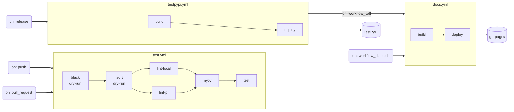

[](https://github.com/Hasenpfote/pyenv_poetry_tox_pytest_example/actions/workflows/test.yml)

# pyenv + poetry + tox + pytest 環境構築例

## 要約

python で pyenv + poetry + tox + pytest に

- pytest の拡張

  pytest-mock + pytest-cov

- linter/formatter

  black + isort + flake8 + mypy

- API の文書化

  pdoc

- 動的バージョニング

  poetry-dynamic-versioning

- CI/CD

  gh-actions

特に注釈がなければ, 各種情報の背景は 2022年12月あたり.  

## 前提条件

- OS は Linux または Windows を想定
- 任意の python 環境は [pyenv](https://github.com/pyenv/pyenv) で構築  
  Windows の場合は [pyenv-win](https://github.com/pyenv-win/pyenv-win) で代替
- 仮想環境は [poetry](https://github.com/python-poetry/poetry) で構築  
  グループ機能が便利なのでバージョンは 1.2 以上.
- 本例では python 3.7 / 3.8 を想定  
  3.8 は現行バージョンで, 3.7 は後方互換の最小バージョンとした開発を行っている状況など.  
  **※ 3.7 未満は依存関係がカオスなので全力回避**
- テストは [tox](https://github.com/tox-dev/tox) + [pytest](https://github.com/pytest-dev/pytest)
- 面倒なことはしない



## 基本

### 準備

#### pyenv

##### インストール

###### for Linux

- [Automatic installer](https://github.com/pyenv/pyenv#automatic-installer) を利用
- 詳細は [pyenv installer](https://github.com/pyenv/pyenv-installer)
- 環境毎の違いは [Troubleshooting / FAQ](https://github.com/pyenv/pyenv/wiki#troubleshooting--faq)

###### for Windows

選択肢が多いので [Installation](https://github.com/pyenv-win/pyenv-win#installation) からお好みで.

Chocolatey 以外は環境変数の設定が必要になるので[詳細](https://github.com/pyenv-win/pyenv-win/blob/master/docs/installation.md)を参考に.

#### python

##### インストール

候補を確認

```bash
$ pyenv install -l
```

とある環境での最新は 3.7.9 / 3.8.10 だったのでインストール

```bash
$ pyenv install 3.7.9
$ pyenv install 3.8.10
```

インストール済みバージョンの確認

```bash
$ pyenv versions
```

#### poetry

##### インストール

[2022/12/07] この時点での最新は 1.2.2 で [ドキュメント](https://python-poetry.org/docs/#system-requirements) より

> ## System requirements
>
> Poetry requires **Python 3.7+**. It is multi-platform and the goal is to make it work equally well on Linux, macOS and Windows.

予め**システム**に python 3.7 以上をインストール要.

**poetry を動作させるために必要であって, プロジェクトへの制約ではない.**

[Installation](https://python-poetry.org/docs/#installation) を参考にお好みで.

##### 設定

###### プロジェクト下に仮想環境を構築

設定を確認

```bash
$ poetry config --list
```

`virtualenvs.in-project = null` なら下記を一度だけ実行

```bash
$ poetry config virtualenvs.in-project true
```

もしもプロジェクト毎に有効にしたいのであれば

```bash
$ poetry config virtualenvs.in-project true --local
```

好みの問題ではあるが, 本例では全体設定としておく.

### 手順

#### 1. 新規プロジェクトを作成

任意の場所で

```bash
$ poetry new --src pyenv_poetry_tox_pytest_example
```

ディレクトリ

```bash
pyenv_poetry_tox_pytest_example
├─ pyproject.toml
├─ README.md
├─ src
│  └─ pyenv_poetry_tox_pytest_example
│      └─ __init__.py
└─tests
   └─ __init__.py
```

- [Choosing a test layout / import rules](https://docs.pytest.org/en/latest/explanation/goodpractices.html#tests-outside-application-code)
- [Packaging a python library](https://blog.ionelmc.ro/2014/05/25/python-packaging/#the-structure)

####  2. 使用する python を指定

プロジェクトルートに移動

```bash
$ cd pyenv_poetry_tox_pytest_example
```

**以降は特に注釈がない限りはプロジェクトルートでコマンドを実行している**

使用する python を指定

```bash
$ pyenv local 3.8.10 3.7.9
```

有効になっているバージョンを確認

```bash
$ python -V
Python 3.8.10
```

本例では 3.8.10 を現行バージョンと想定している.

##### 特記事項

動作確認を行った環境では,

- ` pyenv local 3.8.10 3.7.9` なら `python -V` で`3.8.10`
- ` pyenv local 3.7.9 3.8.10` なら `python -V` で `3.7.9`

**最初に指定をしたバージョンが有効になる.**

仮想環境の構築にも影響があるので要注意.

ディレクトリ

```bash
pyenv_poetry_tox_pytest_example
├─ .python-version (New!)
├─ pyproject.toml
├─ README.md
├─ src
│  └─ pyenv_poetry_tox_pytest_example
│      └─ __init__.py
└─tests
   └─ __init__.py
```

#### 3. `pyproject.toml` でバージョンを指定

以下のように指定をしておく.

```toml
[tool.poetry.dependencies]
python = "^3.7"
```

意味は 3.7 <= python version < 4.0 と若干緩め.

依存するモジュールによっては制限を厳しくする必要もある.

#### 4. 仮想環境を構築

 3.8.10 ベースで構築.

```bash
$ poetry env use python
```

確認は

```bash
$ poetry env info
```

ディレクトリ

```bash
pyenv_poetry_tox_pytest_example
├─ .python-version
├─ pyproject.toml
├─ README.md
├─ .venv (New!)
│  └─ ...
├─ src
│  └─ pyenv_poetry_tox_pytest_example
│      └─ __init__.py
└─tests
   └─ __init__.py
```

####  5. コードを配置

適当な機能をまとめた `utils.py` と, そのテストコードを配置する.

ディレクトリ

```bash
pyenv_poetry_tox_pytest_example
├─ .python-version
├─ pyproject.toml
├─ README.md
├─ .venv
│  └─ ...
├─ src
│  └─ pyenv_poetry_tox_pytest_example
│      ├─ __init__.py
│      └─ utils.py (New!)
└─tests
   ├─ __init__.py
   └─ test_utils.py (New!)
```

#### 6. テスト環境の準備

`poetry add` でも構わないが, 本例では諸事情から `pyproject.toml` に直接記述をする.

```toml
[tool.poetry.group.dev]
optional = true

[tool.poetry.group.dev.dependencies]
tox = "^3.27.1"

[tool.poetry.group.test]
optional = true

[tool.poetry.group.test.dependencies]
pytest = "^7.2.0"

[tool.pytest.ini_options]
addopts = [
  "--import-mode=importlib",
]
pythonpath = "src"
```

- [2022/12/09] tox >= 4.0.0 で仮想環境を認識できない不具合を確認  
  Linux Mint 21 / Windows10 共に, アクティブになっている１つの環境しか認識されない.  
  本例では 3.7 が認識されずスキップされる.

インストール

```bash
$ poetry install --with dev
```

インストールでエラーがでるようならロックファイルの更新で対応

```bash
$ poetry update
```

確認

```bash
$ poetry show
```

#### 7. `tox.ini` の配置

```ini
[tox]
envlist =
    py{37,38}
skipsdist = true
isolated_build = true

[testenv]
allowlist_externals =
    poetry
commands_pre =
    poetry install --with test -v
commands =
    poetry run pytest -v
```

- `py37` / `py38` は `pyenv local` で指定されたバージョンを参照する `tox` 側のキーワード.  
  もしも 3.11.x が必要なら `py311` となる.

ディレクトリ

```bash
pyenv_poetry_tox_pytest_example
├─ .python-version
├─ poetry.lock
├─ pyproject.toml
├─ README.md
├─ tox.ini (New!)
├─ .venv
│  └─ ...
├─ src
│  └─ pyenv_poetry_tox_pytest_example
│      ├─ __init__.py
│      └─ utils.py
└─tests
   ├─ __init__.py
   └─ test_utils.py
```

#### 8. テストを実行

```bash
$ poetry run tox
```

**本例では python 3.7 環境でエラーが発生するようにしている.**

ディレクトリ

```bash
pyenv_poetry_tox_pytest_example
├─ .python-version
├─ poetry.lock
├─ pyproject.toml
├─ README.md
├─ tox.ini
├─ .tox (New!)
│  └─ ...
├─ .venv
│  └─ ...
├─ src
│  └─ pyenv_poetry_tox_pytest_example
│      ├─ __pycache__
│      │  └─ ...
│      ├─ __init__.py
│      └─ utils.py
└─tests
   ├─ __pycache__
   │  └─ ...
   ├─ __init__.py
   └─ test_utils.py
```

### 各種ファイル

#### `pyproject.toml`

```toml
[tool.poetry]
name = "pyenv_poetry_tox_pytest_example"
version = "0.1.0"
description = ""
authors = ["name <email>"]
readme = "README.md"
packages = [{include = "pyenv_poetry_tox_pytest_example", from = "src"}]

[tool.poetry.dependencies]
python = "^3.7"

[tool.poetry.group.dev]
optional = true

[tool.poetry.group.dev.dependencies]
tox = "^3.27.1"

[tool.poetry.group.test]
optional = true

[tool.poetry.group.test.dependencies]
pytest = "^7.2.0"

[build-system]
requires = ["poetry-core>=1.0.0"]
build-backend = "poetry.core.masonry.api"

[tool.pytest.ini_options]
addopts = [
  "--import-mode=importlib",
]
pythonpath = "src"
```

#### `tox.ini`

```ini
[tox]
envlist =
    py{37,38}
skipsdist = true
isolated_build = true

[testenv]
allowlist_externals =
    poetry
commands_pre =
    poetry install --with test -v
commands =
    poetry run pytest -v
```

#### `.gitignore`

```txt
/.tox
/.venv
/.python-version
/poetry.lock

__pycache__/
```

- `.python-version` は環境次第でマイナーバージョンに大きな差があるため.
- `poetry.lock` はお好みで.
- 最終的には[Python.gitignore](https://github.com/github/gitignore/blob/main/Python.gitignore)を元に調整.

## 拡張

基本で目的は果たしているものの, 心許ないので一手間を加える場合もある.  

好みもあるので以降は optional となる.  

### 拡張 1 - pytest の拡張

- mocker fixture の追加

  [pytest-mock](https://github.com/pytest-dev/pytest-mock)

- coverage reports の追加

  [pytest-cov](https://github.com/pytest-dev/pytest-cov)

#### 準備

`./pyproject.toml`

```toml
...
[tool.poetry.group.test]
optional = true

[tool.poetry.group.test.dependencies]
pytest = "^7.2.0"
pytest-mock = "^3.10.0"
pytest-cov = "^4.0.0"
...
```

`./tox.ini`

```ini
[tox]
envlist =
    clean
    py{37,38}
    report
skipsdist = true
isolated_build = true

[testenv]
allowlist_externals =
    poetry
commands_pre =
    poetry install --with test -v
commands =
    poetry run pytest --cov --cov-append --cov-report=term-missing -v

[testenv:clean]
deps = coverage
skip_install = true
commands_pre = # nop
commands =
    poetry run coverage erase

[testenv:report]
deps = coverage
skip_install = true
commands_pre = # nop
commands =
    poetry run coverage report -m
    poetry run coverage html

...
```

#### 手順

- インストール

  ```bash
  $ poetry install --with test
  ```

- 実行

  ```bash
  $ poetry run tox -r -e clean,py37,py38,report
  ```

  並列で行う場合は,

  `./tox.ini`

  ```ini
  ...
  [testenv]
  ...
  depends =
      py{37,38}: clean
      report: py{37,38}
  # Required if -p is enabled on Windows.
  # https://github.com/tox-dev/tox/pull/2641
  setenv =
      PYTHONIOENCODING=utf-8
  ...
  ```

  を追記し

  ```bash
  $ poetry run tox -r -e clean,py37,py38,report -p all
  ```

  順序は `depends` で解決するので適当でもよい.  

### 拡張 2 - linter/formatter

#### 構成

##### solution

- [black](https://github.com/psf/black)

  コードの整形に利用.

- [isort](https://github.com/PyCQA/isort)

  `import` の並び替えに利用.

- [flake8p](https://github.com/john-hen/Flake8-pyproject)

  構文チェックに利用.

  `poetry` 経由で利用するので[オリジナル](https://github.com/PyCQA/flake8)は使えない.

  [2022/12/11] [pflake8](https://github.com/csachs/pyproject-flake8) は `max-line-length` が反映されなかったので選択肢を変更した.

  79 / 88 / 120 宗派のため.

- [mypy](https://github.com/python/mypy)

  型ヒントに利用.

  取り敢えず組み込んでおき, いつでも optional から変更できるように配慮.



##### 環境

`vscode` 環境とそれ以外を考慮しつつ, 最終的にリポジトリへのコミットで同一性を担保する方向で.

- `solution` の設定は `pyproject.toml` で一元管理
- `vscode` は `poetry` で作成した仮想環境を利用するように設定
- `tox` に確認用の環境を仕込んでおく
- [pre-commit](https://github.com/pre-commit/pre-commit) でコミットをフックする



#### 準備

`./pyproject.toml`

```toml
...
[tool.poetry.group.dev.dependencies]
black = "^22.10.0"
isort = "^5.10.1"
Flake8-pyproject = "^1.2.2"
mypy = "^0.991"
pre-commit = "^2.20.0"
tox = "^3.27.1"

...
[tool.black]
line-length = 88
skip-string-normalization = true

[tool.isort]
profile = "black"
line_length = 88
multi_line_output = 3
include_trailing_comma = true

[tool.flake8]
max-line-length = 88
extend-ignore = ["E203", "E266", "W503",]
max-complexity = 10
extend-exclude = [".venv", "dist", ".github",]

[tool.mypy]
ignore_errors = true
#disallow_untyped_defs = true
#ignore_missing_imports = true
#no_implicit_optional = true
#show_error_context = true
#show_column_numbers = true
#warn_return_any = true
#warn_unused_ignores = true
#warn_redundant_casts = true
exclude = ["dist/",]

...
```

**`mypy` を `ignore_errors = true` で実質的に無効にしているので注意.**

`./tox.ini`

```ini
[tox]
envlist =
    py{37,38}
    black
    isort
    flake8
    mypy
skipsdist = true
isolated_build = true

...

[testenv:black]
deps = black
commands_pre = # nop
commands =
    poetry run black . --check --diff --color

[testenv:isort]
deps =
    isort
    colorama
commands_pre = # nop
commands =
    poetry run isort . --check --diff --color

[testenv:flake8]
deps = Flake8-pyproject
commands_pre = # nop
commands =
    poetry run flake8p .

[testenv:mypy]
deps = mypy
commands_pre = # nop
commands =
    poetry run mypy .
```

`./.pre-commit-config.yaml`

```yaml
repos:
  - repo: https://github.com/pre-commit/pre-commit-hooks
    rev: v4.4.0
    hooks:
      - id: check-added-large-files
      - id: check-toml
      - id: check-yaml
      - id: end-of-file-fixer
      - id: mixed-line-ending
        args: [--fix=lf]
      - id: trailing-whitespace
        args: [--markdown-linebreak-ext=md]
  - repo: https://github.com/psf/black
    rev: 22.12.0
    hooks:
      - id: black
        language_version: python3
  - repo: https://github.com/pycqa/isort
    rev: 5.10.1
    hooks:
      - id: isort
  - repo: https://github.com/pycqa/flake8
    rev: 6.0.0
    hooks:
      - id: flake8
        additional_dependencies: [Flake8-pyproject]
  - repo: https://github.com/pre-commit/mirrors-mypy
    rev: v0.991
    hooks:
      - id: mypy
```

#### 手順

- インストール

  ```bash
  $ poetry install --with dev
  ```

- `vscode` 環境以外で直接実行

  ```bash
  $ poetry run black .
  $ poetry run isort .
  $ poetry run flake8 .
  $ poetry run mypy .
  ```

- `vscode` 環境以外で tox 経由で実行

  ```bash
  $ poetry run tox black
  $ poetry run tox isort
  $ poetry run tox flake8
  $ poetry run tox mypy
  ```

- `pre-commit` を編集時に適用する

  ```bash
  $ poetry run pre-commit install
  ```

#### 補足

- 実行パス `.` の由来や除外するディレクトリ
  - black  
    デフォルト動作は `.gitignore` を利用する.  
    思想が垣間見れるのは, [ココ](https://black.readthedocs.io/en/stable/usage_and_configuration/the_basics.html#next-steps) や [ココ](https://black.readthedocs.io/en/stable/usage_and_configuration/file_collection_and_discovery.html#gitignore).  
  - isort  
    [Compatibility with black](https://pycqa.github.io/isort/docs/configuration/black_compatibility.html) を謳っているので追従している.  
  - flake8  
    何もしない.  
  - mypy  
    デフォルト動作は隠しディレクトリを除外する.

### 拡張 3 - API の文書化

ライブラリ色の強いプロジェクトでは API の文書化が必要なので, ここでは [pdoc](https://github.com/mitmproxy/pdoc) を利用した方法を示す.  

[sphinx](https://github.com/sphinx-doc/sphinx) でも大差はない.  

#### 準備

`./pyproject.toml`

```toml
...
[tool.poetry.group.docs]
optional = true

[tool.poetry.group.docs.dependencies]
pdoc = "^12.3.0"
tomli = {version = "^2.0.1", python = "<3.11"}
...
```

`./docs/make.py`

```python
import importlib
from pathlib import Path

import pdoc

try:
    import tomllib
except ModuleNotFoundError:
    import tomli as tomllib

if __name__ == '__main__':
    here = Path(__file__).parent
    project_root_dir = here / '..'

    toml_path = project_root_dir / 'pyproject.toml'
    with open(toml_path, mode='rb') as f:
        toml_dict = tomllib.load(f)
        project = toml_dict['tool']['poetry']['name']
        module = importlib.import_module(project)
        version = toml_dict['tool']['poetry']['version']

    # Render docs
    pdoc.render.configure(
        docformat='google',
        footer_text=f'{module.__name__} {version}',
    )

    pdoc.pdoc(
        project_root_dir / 'src' / module.__name__,
        output_directory=project_root_dir / 'docs/build',
    )
```

宗教上の理由がある場合は下記を参照.  

[...use numpydoc or Google docstrings?](https://pdoc.dev/docs/pdoc.html#use-numpydoc-or-google-docstrings)

#### 手順

- インストール

  ```bash
  $ poetry install --with docs
  ```

- 実行

  ```bash
  $ poetry run python ./docs/make.py
  ```

### 拡張 4 - 動的バージョニング

VCS を基点に動的なバージョン管理を行う.  
[poetry-dynamic-versioning](https://github.com/mtkennerly/poetry-dynamic-versioning) を利用する.  

利用するのはデフォルト動作で, `poetry build` を実行している間だけ有効であることに注意.  



#### 準備

[Installation](https://github.com/mtkennerly/poetry-dynamic-versioning#installation)  

"0.0.0" の由来は

> Poetry's typical `version` setting is still required in `[tool.poetry]`, but you are encouraged to use `version = "0.0.0"` as a standard placeholder.


`./pyproject.toml`

```toml
[tool.poetry]
...
version = "0.0.0"
...
[build-system]
requires = ["poetry-core>=1.0.0", "poetry-dynamic-versioning"]
build-backend = "poetry_dynamic_versioning.backend"

[tool.poetry-dynamic-versioning]
enable = true
vcs = "git"
style = "pep440"

[tool.poetry-dynamic-versioning.substitution]
folders = [
  { path = "src" }
]
...
```

`./src/pyenv_poetry_tox_pytest_example/__version__.py`

```python
__version__ = '0.0.0'
```

`./src/pyenv_poetry_tox_pytest_example/__init__.py`

```python
from .__version__ import __version__
```

#### 手順

- プラグインのインストール

  ```bash
  $ poetry self add "poetry-dynamic-versioning[plugin]"
  ```

- プラグインのアンインストール

  ```bash
  $ poetry self remove poetry-dynamic-versioning
  ```

- バージョニング

  1. タグをつける

     `v0.0.0` から `v0.1.0` にする場合

     ```bash
     $ git tag v0.1.0
     ```

  2. ビルドを実行する

     ```bash
     $ poetry build
     ```

  `./dist` 内に含まれる対象/関連ファイルのみ影響を受ける.  

  よってリリース後の `pyenv_poetry_tox_pytest_example.__version__` などは意図した動作になる.  

#### 連携

- **拡張 3 - API の文書化** と連携する場合について

  `poetry-dynamic-versioning` を手動で実行する方法も考えられるがとても煩雑になる.  

  よって VCS からタグを取得する方向で済ませる.  

  ```mermaid
  flowchart LR

    subgraph versioning
      id_v1[git tag v0.1.0]
    end

    subgraph documentation
      id_d1[poetry run python ./docs/make.py]
    end

    build[(./docs/build)]

    versioning ==> documentation
    id_d1 .-> build
  ```

  `./pyproject.toml`

  ```toml
  ...
  [tool.poetry.group.docs]
  optional = true

  [tool.poetry.group.docs.dependencies]
  pdoc = "^12.3.0"
  tomli = {version = "^2.0.1", python = "<3.11"}
  GitPython = "^3.1.29"
  ...
  ```

  `./docs/make.py`

  ```python
  import importlib
  import os
  from pathlib import Path

  import git
  import pdoc

  try:
      import tomllib
  except ModuleNotFoundError:
      import tomli as tomllib

  if __name__ == '__main__':
      here = Path(__file__).parent
      project_root_dir = here / '..'

      toml_path = project_root_dir / 'pyproject.toml'
      with open(toml_path, mode='rb') as f:
          toml_dict = tomllib.load(f)
          project = toml_dict['tool']['poetry']['name']
          module = importlib.import_module(project)
          version = toml_dict['tool']['poetry']['version']

      if version == '0.0.0':
          repo_dir = project_root_dir / '.git'
          if os.path.isdir(repo_dir):
              repo = git.Repo(repo_dir)
              if repo.tags:
                  tags = sorted(repo.tags, key=lambda t: t.commit.committed_datetime)
                  latest_tag = tags[-1]
                  version = str(latest_tag)
                  if version.startswith('v'):
                      version = version[1:]

      # Render docs
      pdoc.render.configure(
          footer_text=f'{module.__name__} {version}',
      )

      pdoc.pdoc(
          project_root_dir / 'src' / module.__name__,
          output_directory=project_root_dir / 'docs/build',
      )
  ```

### 拡張 5 - CI/CD

ここでは [GitHub Actions](https://docs.github.com/en/actions) を利用した例となる.  

デプロイ先は

- パッケージは [TestPyPI](https://test.pypi.org)  
- API ドキュメントは [GitHub Pages](https://docs.github.com/en/pages/getting-started-with-github-pages/creating-a-github-pages-site)



#### 準備

`./github/python-version.txt`

```python
3.8
```

各ファイルで用いる, 開発上の現行バージョンを指定.  

`./github/workflows/test.yml`

```python
name: Test

on: [ push, pull_request ]

permissions:
  contents: read

jobs:
  black:
    if: true
    runs-on: ubuntu-latest
    steps:
      - uses: actions/checkout@v3
      - uses: actions/setup-python@v4
        with:
          python-version-file: .github/python-version.txt
      - name: Install dependencies
        run: |
          python -m pip install --upgrade pip
          python -m pip install 'poetry>=1.2'
          poetry install --with dev --no-interaction
      - name: Lint with black
        run: |
          poetry run tox -e black

  isort:
    if: true
    runs-on: ubuntu-latest
    steps:
      - uses: actions/checkout@v3
      - uses: actions/setup-python@v4
        with:
          python-version-file: .github/python-version.txt
      - name: Install dependencies
        run: |
          python -m pip install --upgrade pip
          python -m pip install 'poetry>=1.2'
          poetry install --with dev --no-interaction
      - name: Lint with isort
        run: |
          poetry run tox -e isort

  lint-pr:
    if: github.event_name == 'pull_request'
    runs-on: ubuntu-latest
    steps:
      - uses: actions/checkout@v3
      - uses: TrueBrain/actions-flake8@v2

  lint-local:
    if: github.event_name == 'push'
    runs-on: ubuntu-latest
    steps:
      - uses: actions/checkout@v3
      - uses: actions/setup-python@v4
        with:
          python-version-file: .github/python-version.txt
      - name: Install dependencies
        run: |
          python -m pip install --upgrade pip
          python -m pip install 'poetry>=1.2'
          poetry install --with dev --no-interaction
      - name: Lint with flake8
        run: |
          poetry run tox -e flake8

  mypy:
    if: true
    runs-on: ubuntu-latest
    steps:
      - uses: actions/checkout@v3
      - uses: actions/setup-python@v4
        with:
          python-version-file: .github/python-version.txt
      - name: Install dependencies
        run: |
          python -m pip install --upgrade pip
          python -m pip install 'poetry>=1.2'
          poetry install --with dev --no-interaction
      - name: Lint with mypy
        run: |
          poetry run tox -e mypy

  test:
    runs-on: ubuntu-20.04
    strategy:
      fail-fast: false
      matrix:
        python-version: ['3.7', '3.8']
    steps:
    - uses: actions/checkout@v3
    - name: Set up Python ${{ matrix.python-version }}
      uses: actions/setup-python@v4
      with:
        python-version: ${{ matrix.python-version }}
    - name: Install dependencies
      run: |
        python -m pip install --upgrade pip
        python -m pip install 'poetry>=1.2'
        poetry install --with dev --no-interaction
    - name: Test with pytest
      run: |
        poetry run tox -e py
```

`test` は対象範囲が変わる都度, 設定を変更する必要がある.  

`./github/workflows/testpypi.yml`

```python
name: Publish the package to TestPyPI

on:
  workflow_dispatch:
  release:
    types: [published]

jobs:
  deploy:
    runs-on: ubuntu-latest
    steps:
    - uses: actions/checkout@v3
      with:
        fetch-depth: 0
    - name: Set up Python
      uses: actions/setup-python@v4
      with:
        python-version-file: .github/python-version.txt
    - name: Install dependencies
      run: |
        python -m pip install --upgrade pip
        python -m pip install 'poetry>=1.2'
        poetry self add 'poetry-dynamic-versioning[plugin]'
    - name: Build
      run: |
        poetry build
    - name: publish
      env:
        TESTPYPI_API_TOKEN: ${{ secrets.TESTPYPI_API_TOKEN }}
      run: |
        poetry config repositories.test-pypi https://test.pypi.org/legacy/
        poetry config pypi-token.test-pypi $TESTPYPI_API_TOKEN
        poetry publish -r test-pypi

  docs:
    if: true # true if documentation is needed.
    needs: deploy
    permissions:
      contents: read
      pages: write
      id-token: write
    uses: ./.github/workflows/docs.yml
```

`docs` は API の文書化が不要なら `false` に設定.  

`./github/workflows/docs.yml`

```python
# Workflow for deploying static content to GitHub Pages
name: Deploy static content to Pages

# build the documentation whenever there are new commits on main
on:
  workflow_dispatch:
  workflow_call:

# security: restrict permissions for CI jobs.
permissions:
  contents: read

jobs:
  # Build the documentation and upload the static HTML files as an artifact.
  build:
    runs-on: ubuntu-latest
    steps:
      - uses: actions/checkout@v3
        with:
          fetch-depth: 0
      - uses: actions/setup-python@v4
        with:
          python-version-file: .github/python-version.txt
      - name: Install dependencies
        run: |
          python -m pip install --upgrade pip
          python -m pip install 'poetry>=1.2'
          poetry install --with docs --no-interaction
      - name: Build
        run: |
          poetry run python ./docs/make.py
      - uses: actions/upload-pages-artifact@v1
        with:
          path: docs/build/

  # Deploy the artifact to GitHub pages.
  # This is a separate job so that only actions/deploy-pages has the necessary permissions.
  deploy:
    needs: build
    runs-on: ubuntu-latest
    permissions:
      pages: write
      id-token: write
    environment:
      name: github-pages
      url: ${{ steps.deployment.outputs.page_url }}
    steps:
      - id: deployment
        uses: actions/deploy-pages@v1
```

#### 手順

- `on: push`

  ```bash
  $ git push
  ```

- `on: pull_request`

  PR

- `on: release`

  ```bash
  $ git tag v0.1.0
  $ git push origin v0.1.0
  ```

  `v0.1.0` をリリース  

  [Managing releases in a repository](https://docs.github.com/en/repositories/releasing-projects-on-github/managing-releases-in-a-repository)

- `on: workflow_dispatch`

  デバッグ用に手動でイベントをキック.  

#### 補足

- `on: workflow_dispatch`

  `docs.yml` を手動で実行すると `main` ブランチ(default)が渡される.  

- `on: workflow_call`

  `testpypi.yml` 経由で実行されると `on: release` で `v0.1.0` ブランチが渡される.  

  gh-pages の[ブランチ保護ルール](https://docs.github.com/en/repositories/configuring-branches-and-merges-in-your-repository/defining-the-mergeability-of-pull-requests/managing-a-branch-protection-rule)に後者が利用できるように追記が必要.  
  例えば `v*` などとしておく.  

## 参考

- [Simple Python Version Management: pyenv](https://github.com/pyenv/pyenv)
- [pyenv for Windows](https://github.com/pyenv-win/pyenv-win)
- [Poetry](https://python-poetry.org)
- [tox](https://github.com/tox-dev/tox)
- [pytest](https://github.com/pytest-dev/pytest)
- [pytest-mock](https://github.com/pytest-dev/pytest-mock)
- [pytest-cov](https://github.com/pytest-dev/pytest-cov)
- [black](https://github.com/psf/black)
- [isort](https://github.com/PyCQA/isort)
- [flake8p](https://github.com/john-hen/Flake8-pyproject)
- [mypy](https://github.com/python/mypy)
- [pre-commit](https://github.com/pre-commit/pre-commit)
- [pdoc](https://github.com/mitmproxy/pdoc)
- [poetry-dynamic-versioning](https://github.com/mtkennerly/poetry-dynamic-versioning)
- [GitHub Actions](https://docs.github.com/en/actions)
