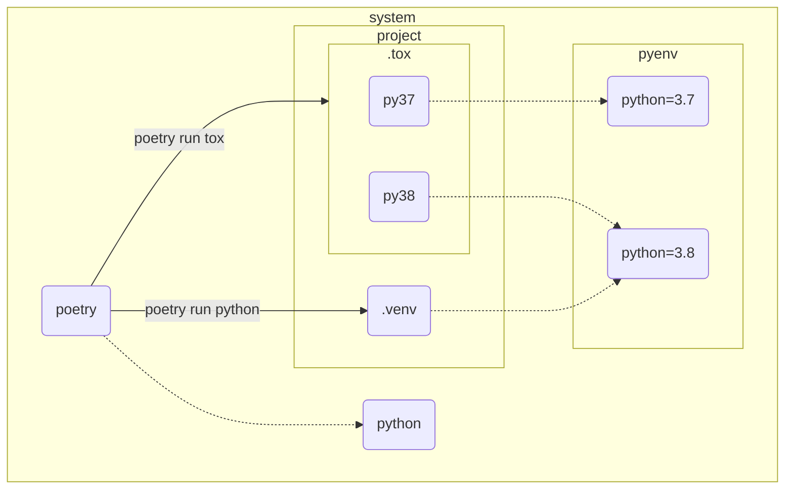

# pyenv + poetry + tox + pytest 環境構築例

最小限の事例を記す.

## 前提

- OS は Linux または Windows を想定

- 任意の python 環境は [pyenv](https://github.com/pyenv/pyenv) で構築

  Windows の場合は [pyenv-win](https://github.com/pyenv-win/pyenv-win) で代替  

- [poetry](https://github.com/python-poetry/poetry) で仮想環境を構築

- 本例では python 3.7 / 3.8 を想定

  3.8 は現行バージョンで, 3.7 は後方互換の最小バージョンとしたアプリを開発している状況など.  
  
  **※ 3.7 未満は依存関係がカオスなので全力回避**
  
- テストは [tox](https://github.com/tox-dev/tox) + [pytest](https://github.com/pytest-dev/pytest)



## 準備

### pyenv

#### インストール

##### for Linux

- [Automatic installer](https://github.com/pyenv/pyenv#automatic-installer) を利用
- 詳細は [pyenv installer](https://github.com/pyenv/pyenv-installer)
- 環境毎の違いは [Troubleshooting / FAQ](https://github.com/pyenv/pyenv/wiki#troubleshooting--faq)

##### for Windows

選択肢が多いので [Installation](https://github.com/pyenv-win/pyenv-win#installation) からお好みで.

Chocolatey 以外は環境変数の設定が必要になるので[詳細](https://github.com/pyenv-win/pyenv-win/blob/master/docs/installation.md)を参考に.

### python 

#### インストール

候補を確認

```bash
$ pyenv install -l
```

とある環境での最新は 3.7.9 / 3.8.10 だったのでインストール

```bash
$ pyenv install 3.7.9
$ pyenv install 3.8.10
```

インストール済みバージョンの確認

```bash
$ pyenv versions
```

### poetry

#### インストール

[2022/12/07] この時点での最新は 1.2.2 で [ドキュメント](https://python-poetry.org/docs/#system-requirements) より

> ## System requirements
>
> Poetry requires **Python 3.7+**. It is multi-platform and the goal is to make it work equally well on Linux, macOS and Windows.

予め**システム**に python 3.7 以上をインストール要.  

**poetry を動作させるために必要であって, プロジェクトへの制約ではない.**  

[Installation](https://python-poetry.org/docs/#installation) を参考にお好みで.  

#### 設定

##### プロジェクト下に仮想環境を構築

設定を確認

```bash
$ poetry config --list
```

`virtualenvs.in-project = null` なら下記を一度だけ実行

```bash
$ poetry config virtualenvs.in-project true
```

もしもプロジェクト毎に有効にしたいのであれば

```bash
$ poetry config virtualenvs.in-project true --local
```

好みの問題ではあるが, 本例では全体設定としておく.

## 手順

### 1. 新規プロジェクトを作成

任意の場所で

```bash
$ poetry new pyenv_poetry_tox_pytest_example
```

ディレクトリ

```bash
pyenv_poetry_tox_pytest_example
│   pyproject.toml
│   README.md
│
├─pyenv_poetry_tox_pytest_example
│     __init__.py
│
└─tests
      __init__.py
```

###  2. 使用する python を指定

```bash
$ cd pyenv_poetry_tox_pytest_example
$ pyenv local 3.8.10 3.7.9
```

有効になっているバージョンを確認

```bash
$ python -V
Python 3.8.10
```

本例では 3.8.10 を現行バージョンと想定している.

#### 特記事項

動作確認を行った環境では, 

- `$ pyenv local 3.8.10 3.7.9` なら `python -V` で`3.8.10`
- `$ pyenv local 3.7.9 3.8.10` なら `python -V` で `3.7.9`

**最初に指定をしたバージョンが有効になる.**

仮想環境の構築にも影響があるので要注意.

ディレクトリ

```bash
pyenv_poetry_tox_pytest_example
│   .python-version (New!)
│   pyproject.toml
│   README.md
│
├───pyenv_poetry_tox_pytest_example
│    __init__.py
│
└───tests
    __init__.py
```

### 3. `pyproject.toml` でバージョンを指定

以下のように指定をしておく.

```toml
python = "^3.7"
```

意味は 3.7 <= python version < 4.0 と若干緩め.  

依存するモジュールによっては制限を厳しくする必要もある.  

### 4. 仮想環境を構築

 3.8.10 ベースで構築.

```bash
$ poetry env use python
```

確認は

```bash
$ poetry env info
```

ディレクトリ

```bash
pyenv_poetry_tox_pytest_example
│    .python-version
│    pyproject.toml
│    README.md
│
├───.venv (New!)
│
├───pyenv_poetry_tox_pytest_example
│    __init__.py
│
└───tests
    __init__.py
```

###  5. コードを配置

適当な機能をまとめた `utils.py` と, そのテストコードを配置する.

ディレクトリ

```
pyenv_poetry_tox_pytest_example
│    .python-version
│    pyproject.toml
│    README.md
│
├───.venv
│
├───pyenv_poetry_tox_pytest_example
│    utils.py (New!)
│    __init__.py
│
└───tests
    test_utils.py (New!)
    __init__.py
```

### 6. テスト環境の準備

`poetry add` でも構わないが, 本例では諸事情から `pyproject.toml` に直接記述をする.

```toml
[tool.poetry.dev-dependencies]
pytest = "^7.2.0"
tox = "^3.27.1"
```

[2022/12/09] tox >= 4.0.0 で仮想環境を認識できない不具合を確認.  

- [2022/12/09] tox >= 4.0.0 で仮想環境を認識できない不具合を確認

  Linux Mint 21 / Windows10 共に, アクティブになっている１つの環境しか認識されない.  

  本例では 3.7 が認識されずスキップされる.  

- 

インストール

```bash
$ poetry install
```

インストールでエラーがでるようならロックファイルの更新で対応

```bash
$ poetry update
```

確認

```bash
$ poetry show
```

### 7. `tox.ini` の配置

```ini
[tox]
envlist =
    py37
    py38
skipsdist = true
isolated_build = true

[testenv]
allowlist_externals =
    poetry
commands =
    poetry install -v
    poetry run pytest -v
```

 `py37` / `py38` は `pyenv local` で指定されたバージョンを参照する `tox` 側のキーワード.  

もしも 3.11.x が必要なら `py311` となる.  


ディレクトリ

```bash
pyenv_poetry_tox_pytest_example
│    .python-version
│    pyproject.toml
│    README.md
│    tox.ini (New!)
│
├───.venv
│
├───pyenv_poetry_tox_pytest_example
│    utils.py
│    __init__.py
│
└───tests
    test_utils.py
    __init__.py
```

### 8. テストを実行

```bash
$ poetry run tox
```

**本例では python 3.7 環境でエラーが発生するようにしている.**

ディレクトリ

```bash
pyenv_poetry_tox_pytest_example
│    .python-version
│    pyproject.toml
│    README.md
│    tox.ini
│
├───.tox (New!)
│
├───.venv
│
├───pyenv_poetry_tox_pytest_example
│    utils.py
│    __init__.py
│
└───tests
    test_utils.py
    __init__.py
```

## .gitignore の設定

一連の手順で生成されるディレクトリの構造は

```bash
pyenv_poetry_tox_pytest_example
│    .python-version
│    pyproject.toml
│    README.md
│    tox.ini
│
├───.tox
│
├───.venv
│
├───pyenv_poetry_tox_pytest_example
│    utils.py
│    __init__.py
│
└───tests
    test_utils.py
    __init__.py
```

不要な構造を削ぎ落すと

```
pyenv_poetry_tox_pytest_example
│    .python-version
│    pyproject.toml
│    README.md
│    tox.ini
│
├───pyenv_poetry_tox_pytest_example
│    utils.py
│    __init__.py
│
└───tests
    test_utils.py
    __init__.py
```

その他, 自動生成されるものも考慮すると最小限の `.gitignore` は

```
/.tox
/.venv
/.python-version
/poetry.lock

__pycache__/
```

`.python-version` は環境次第でマイナーバージョンに大きな差があるため.

`poetry.lock` はお好みで.

## 参考

- [Simple Python Version Management: pyenv](https://github.com/pyenv/pyenv)
- [pyenv for Windows](https://github.com/pyenv-win/pyenv-win)
- [Poetry](https://python-poetry.org)
- [Poetry documentation (ver. 1.1.6 日本語訳)](https://cocoatomo.github.io/poetry-ja/)
- [tox](https://github.com/tox-dev/tox)
- [pytest](https://github.com/pytest-dev/pytest)

